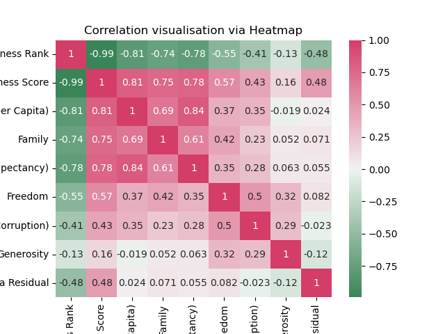
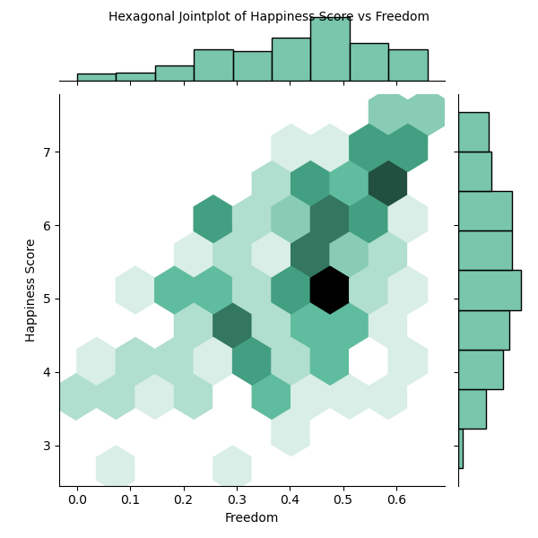
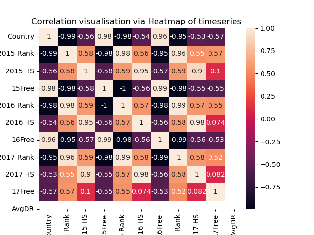
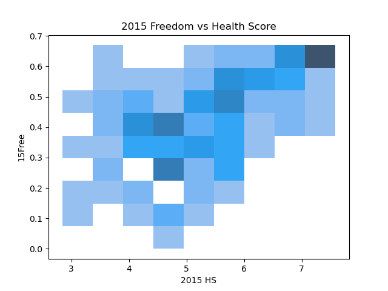
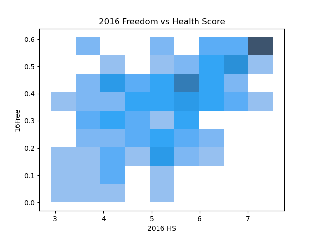
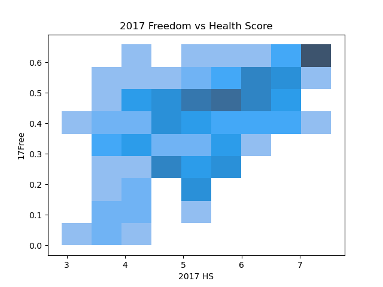
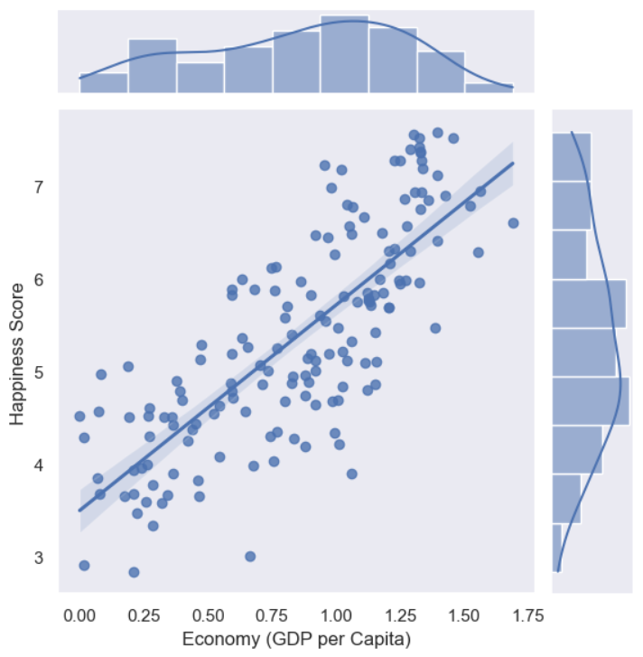
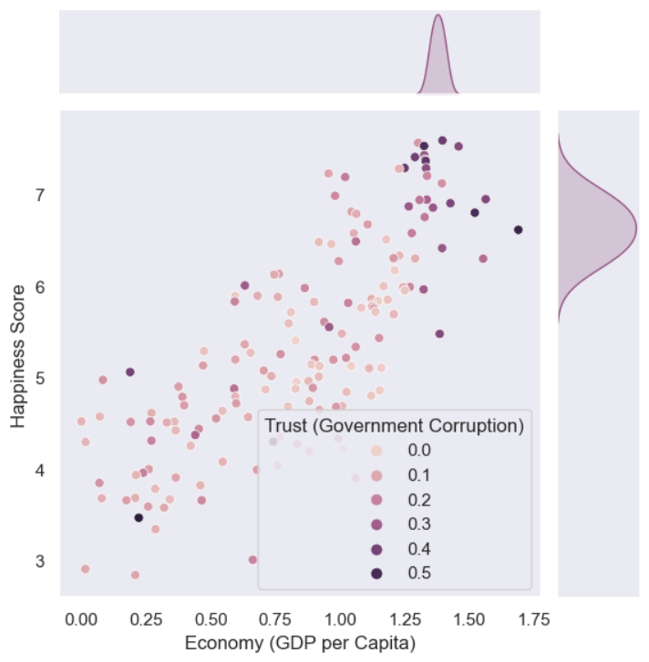
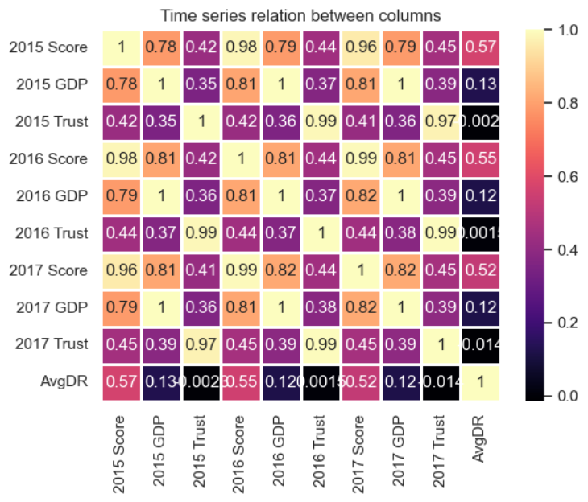

# THE WORLD HAPPINESS REPORT & THE FACTORS THAT AFFECT HAPPINESS

# *Team Members*

- Aaditya Golash (Analysis 1)
- Atharva Jagtap (Analysis 2)
- Tori (Analysis 3)

## Introduction

Happiness is defined as the state of being happy. We are interested in this because happiness isn’t easily quantifiable, so it is an exciting topic. Our main goal in this analytics project is to observe the trends in happiness over the selected timeframe and see how certain changes in the individual factors that relate to happiness affect the general state of the country. This dataset on Kaggle from the World Happiness Report, gave us an insight on how different factors in different countries could influence happiness. Aaditya chose to find out how freedom affects happiness and Atharva chose to find out that whether there was any relationship between the happiness score of a country to its general economic state and the amount of trust in its government. Our findings will give us a deeper understanding on answering one of the most important questions for mankind: What makes us happy?

## Exploratory data analysis highlights

### Exploratory Data Analysis Highlights for Analysis 1

In my EDA, I wanted to see if there was a positive correlation between the happiness score and how free the country is. I first found correlations in my dataset. I used a heatmap to create visualization of the direct correlation and found a correlation of over 0.5 between freedom and happiness. I then selected the most relevant year and made more visualizations that showed me there is a positive correlation between the freedom and happiness just like the hypothesis.

### EDA2

 In the EDA, I explored whether there was any relationship between
the happiness score of a country to its general economic state and the amount of trust in its government. After exploring my data set and creating a handful of visualizations, I came to realize that there was indeed a strong correlation between the happiness score and the economy, whereas the relation is not quite as strong between the peoples trust in the government and its happiness.

## Question + Results

### How does Freedom affect Happiness?

[Link to my Notebook]( https://github.com/ubco-W2022T1-cosc301/project-group41/blob/main/notebooks/analysis1.ipynb)  

Because happiness is such an important emotion, I am interested in researching it. It has an impact on everything we do. Almost everything we do is to make ourselves or others happy, and everything we do affects our happiness directly or indirectly. It is a strong emotion, and the data that shows the factors that influence happiness is extremely valuable to stakeholders, whether they are companies, businesses, or governing bodies. Happiness is difficult to quantify because it is an emotion. This dataset is an excellent example of how this emotion could be quantified. These are some of the reasons I'm curious about this dataset.
Freedom is defined as either the ability to act or change without restriction or the power and resources to pursue one's goals without restriction. How does a country's freedom affect its happiness? is my research question. I'm going to look at how the trends in freedom and happiness change over time.

I hypothesized that **freedom** and **happiness** are inextricably linked.
  
 According to the **heatmap**,**freedom** has an above-average correlation with Happiness Rank and Happiness Score. As Freedom has a 0.55 correlation with Happiness Rank and a 0.57 correlation with Happiness Score.

  

From the **hexplot**: We can see this from the **hexplot** above, as it is darker upwards and to the right, indicating a **positive relationship** between the two. The higher the level of freedom, the higher the level of happiness. Positive relationships can be found all the way down the line.

  

In this **heatmap** we see that there is a strong negative correlation between Health Rank and Freedom for 2015 and 2016 (-0.95) which is a good thing because lower rank would indicate a higher place on the dataset, which would mean more freedom results in better rank. However in 2017 it was quite different which gives us mixed results here.

  
  
  

We can see that there is a positive correlation between Health score and Freedom in 2015.We can see that there is a positive correlation between Health score and Freedom in 2016.We can see that there is a positive correlation between Health score and Freedom in 2017.

What this all shows us is that the hypothesis that freedom is directly correlated to happiness ,and that higher freedom yields a higher happiness rank too is correct.

### Does trust in the government and a stable economy really increase happiness?

#### Link

[Link to Notebook]( https://github.com/ubco-W2022T1-cosc301/project-group41/blob/main/notebooks/analysis2.ipynb)  

 I am curious to learn about how the trend in happiness changes over time and how people are affected by various factors.  The economy is defined as the wealth and resources of a country or region, especially in terms of the production and consumption of goods and services. With the economy being such an important part of our world, I am intrigued to find out how it affects happiness levels. Also, alongside the economy, how much the people trust in their government and its relation to happiness is another interesting thing I want to delve into. With such radical changes in the world today along with the growth of social media I want to know how this affects happiness levels and if there is any correlation between happiness and trust in government.

 To start off, I plotted a graph between the Happiness score and Economy (GDP per Capita),

 As we can see here, it is obvious that the **higher the economy** of the country the **greater is the happiness score**, it is linearly dependent.  

 After which I, compared how the Trust in the government and Happiness Score correlated combined with their GDP.

 According to this plot we notice that the **economy** and the peoples **trust in the government** are somewhat related to one another as a **greater trust** also implies a **better economy (a few exceptions)**. Whether Trust and Happiness are related is still vague and cannot be determined yet.

 To finalize, I looked at the time series correlation for 3 years for all the factors that contributed to the country’s happiness.

 According to our **correlation coefficient** of **0.78, 0.81, and 0.82** stated in the above heat map, we can conclude that a **stable economy (GDP per Capita)** does have a **positive impact** on the **happiness** of the country and its people. A wealthier country will have more resources and therefore can provide for their citizens better than a financially unstable country.

 Meanwhile, we noticed that the correlation of **0.42, 0.44, and 0.45** do **not have a significant influence** on the **happiness score**, which is surprising since the peoples trust in the government should be one of the major factors which affects their happiness as the government is the legal body which is responsible for enforcing new laws and upholding previous ones.

## Summary

 The word ‘happiness’ is used in a number of ways. In this dataset the word is used to denote a sense of satisfaction with life.
 In the broadest sense, freedom can be defined as an individual's ability to make choices, typically major life decisions. The 'ability' to choose necessitates the existence of a 'opportunity' to choose, which is a feature of the environment in which an individual lives.After analysis of multiple graphs and factors which affect the happiness index of countries, we arrive at a conclusion that a stable economy does increase the happiness of a country. While on the contrary, we have come to an astonishing finding that people’s trust in the government does not impact their happiness to a great extent. What this all shows us is that the hypothesis that freedom is directly correlated to happiness ,and that higher freedom yields a higher happiness rank too is correct.This means that countries should put an emphasis on listening to the people's wants and providing them with the freedom they need in order to have a happier populous
